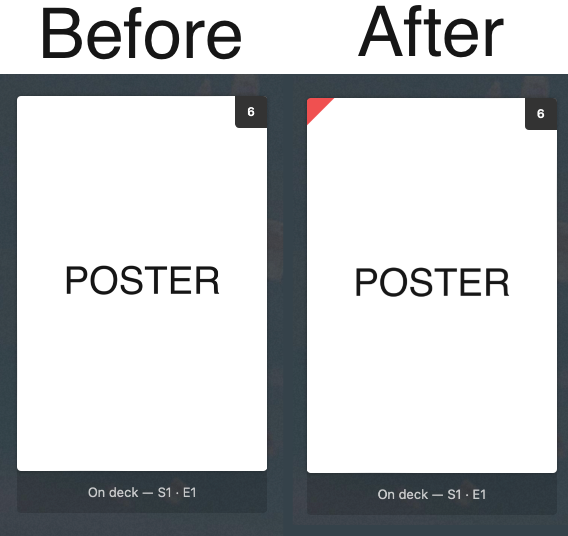

# Plex ended marker #
This script adds a red triangle to the upper left side of plex tv show posters if the series has ended.



### How to run ###

1. Install pip requirements
2. Run main.py


Variables can either be passed as cli args or env vars:

CLI: 

```main.py http://serverip:32400 x-plex-token tmdb-api-key section-to-exclude-1 ... section-to-exclude-n```

ENV:
```
PLEX_BASEURL
PLEX_TOKEN
TVDB_API_KEY
PLEX_EXCLUDE (as list, e.g. export PLEX_EXCLUDE='["TV Shows 1", "TV Shows 2"]')
```

How to get the token: https://support.plex.tv/articles/204059436-finding-an-authentication-token-x-plex-token/